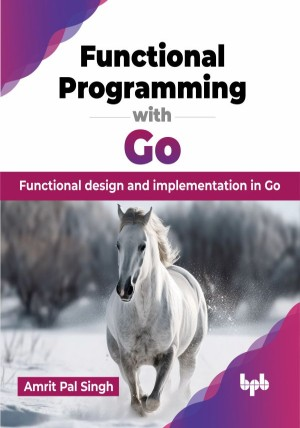

# Functional Programming with Go

Crafting elegant and efficient solutions!

This is the repository for [Functional Programming with Go
](https://bpbonline.com/products/functional-programming-with-go?variant=43807069372616),published by BPB Publications.

## About the Book
"Functional Programming with Go" is a comprehensive guide to introduce Go developers to the powerful concepts of functional programming. This book covers topics like first-class functions, closures, higher-order functions, immutability, and pure functions. It also demonstrates how these principles can enhance code quality, reliability, and maintainability.

Starting with functional programming basics and setup, it covers first-class functions, closures, and higher-order functions like map, filter, and reduce. You will learn advanced techniques like currying, immutability, and functional error handling with monads. The book also explores concurrent programming with FP in Go, design patterns, functional web development, testing, debugging, and advanced topics like memoization.

This book equips you with the knowledge and skills needed to write efficient, scalable, and robust Go applications. By the end of this book, you will have the knowledge and skills to apply functional programming principles in Go.

## What You Will Learn
• Applying functional programming concepts to enhance code quality.

• Leveraging higher-order functions and closures for flexible code.

• Implementing advanced techniques like function currying and partial application.

• Writing pure functions and using immutable data structures in Go.

• Handling errors efficiently using monads and functional techniques.

• Designing concurrent systems with goroutines and channels in Go.
